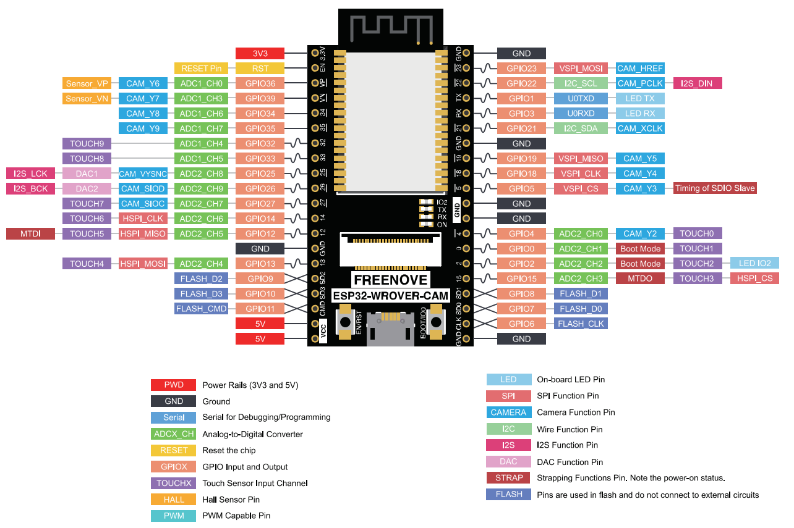
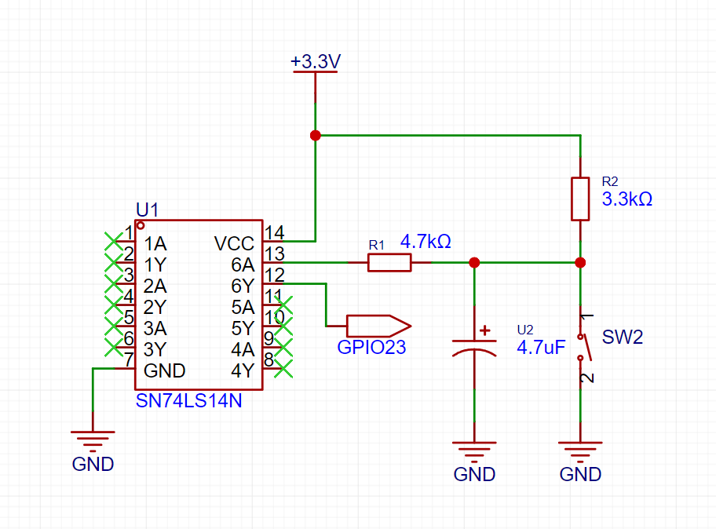
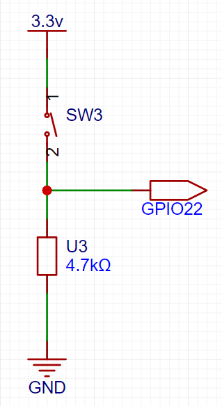
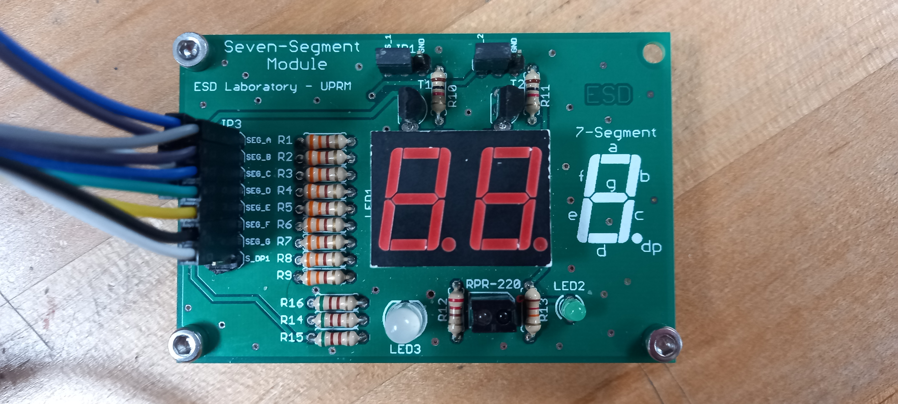

# Report Number 3 | Interrupts, Debouncing and the Keypad

Some lab from microprocessors I did on the esp32. Bellow is a sort of more in-depth version of the lab me and another lad, Victor did. This version is from my own perspective. 

**PS: Hey Vic, if you see this, remind me to finish RE on VR throught the entire class so I don't procrastinate again**

## Objectives

- Understand what is bouncing and the issues related with it
- Learn the hardware and software way of debouncing techniques and their main differences
- Understand how an interrupt process is carried in an MCU
- Learn how to use a keypad using interrupts

| Item # | Qty | Description | Reference |
| ---- | ---- | ---- | ---- |
| 1 | 1 | Devkit | ESP32-S3 Devkit by Heltec Automation |
| 2 | 1 | IDE app | Vscode with PlatformIO |
| 3 | 1 | 7-segment display | LTD-6710P |
| 4 | 1 | 1/4W Carbon fill resistor | $2.7 k\ohm$ |
| 5 | 11 | 1/4W Carbon fill resistor | $220 \ohm$ |
| 6 | 1 | 1/4W Carbon fill resistor | $3.3 k\ohm$ |
| 7 | 3 | 1/4W Carbon fill resistor | $510 \ohm$ |
| 8 | 2 | 1/4W Carbon fill resistor | $4.7 k\ohm$ |
| 9 | 1 | Polarized electrolytic capacitor | $4.7 \mu F$ |
| 10 | 2 | Momentary switch | Pusbutton |
| 11 | 1 | Optoswitch-RPR-220 |  755-RPR-220 |
| 12 | 1 | Schmitt trigger array | 74LS14N |

## Introduction

This is the third lab for the course, and the first time we use the devkit we will use for the project: the ESP32-S3. The devkit is much smaller than the MSP430 we used on the second lab; a small 5.4cm x 2.7cm compared to the huge size of the MSPs we got (haven't taken the size, I'll show a pic and dimensions in next commit). Another difference is the voltage output, where the MSP430 outputs 5V while the ESP32 outputs 3.7V. Bellow is a table showing more differences between the two boards.

In the last lab we learned how to use buttons and use counters to trigger something. This lab takes a closer look at the functionality of those buttons and shows another way we can manage the functionality of a button in an embedded system. Enter interrupts.

An interrupt is an asynchronous signal produced by an external or internal event in a device that generates an _interruption_ in the execution of a program. As described by John Davies, "interrupts are like functions but are requested by hardware at unpredictable times rather than being called by software in an orderly manner". Interrupts serve various purposes, from handling human input, like buttons - a task we performed in this lab, to executing "...urgent tasks that must be executed and has higher priority than the main code". The code responsible for handling interrupts is called an _interrupt handler_, or ISP. It allow us to write more compact code while also reducing CPU cycles, which in turn reduces energy consumption.

Continuing with the use of buttons and switches, these devices suffer from a phenomena called _bouncing_. Bouncing occurs due to how buttons are built; a switch that provide a state of on-off thanks to a spring that bounces off (hence the name "bounce") when you stop pressing it. Basically, the button generates _multiple transitions of a single input_.

## Hardware Implementation

For the hardware implementation we went over the use of a *Schmitt Trigger.*  A Schmitt Trigger Circuit Diagram is a fast-operating voltage level detector. When the input voltage arrives at a level determined by the circuit components, the output voltage switches rapidly between its maximum positive level and its maximum negative level. 

There are different ways to make a *Schmitt Trigger*, for example using an *Resistor-Capacitor* circuit, or RC circuit. The idea of an RC circuit is that the reactance of a capacitor varies inversely with frequency, while keeping the resistor constant as frequency changes. Usually RC circuits are used as low-frequency filters.

This implementation is more economically costly since it requires more hardware. Which is the reason many opt for the software implementation. The idea is that the reactance of a capacitor varies inversely with frequency, while the value of the resistor remains constant as the frequency changes.

## Software Implementation

Here the debouncing is done by the software. There are a few ways to achieve debouncing with software. One way is to perform polling, which is when the CPU constantly checks when said I/O needs CPU processing. Not to confuse with interrupt, which instead of constantly checking it if the I/O needs CPU processing it simply "notices" it; its not a protocol like polling but a hardware mechanism.

# Display

## Conclusion

This lab was really interesting. I learned and re-learned a lot of things from other courses. For example, I had to re-learn how RC circuits work, what is noise, noise margins, and other things. I also went to finally put into practice the things I learned from my electronics and logic circuits class.

While the learning experience was great I encountered lots... LOTS of issues. For starters, I couldn't get the Hx711 display working no matter what I tried in the code. The display uses 5V of power and connecting it to the same ground as the rest of the circuit -which uses 3.3V, caused issues in the logic of the microprocessor. Then when I use the LTD-6710P seven-segment display I realized that some pins in the version of the ESP32 I used are pulldown pins by default while others are pullup. And although the espressif as certain methods such as `gpio_pullup_dis`, `gpio_pullup_en`, `gpio_pulldown_dis` and `gpio_pulldown_dis`, in the ESP32-WROVER's pins showed no effect when testing. 

## References

[Difference between Interrupt and Polling - GeeksforGeeks](https://www.geeksforgeeks.org/difference-between-interrupt-and-polling/)

[GPIO & RTC GPIO - ESP32 — ESP-IDF API Documentation](https://docs.espressif.com/projects/esp-idf/en/latest/esp32/api-reference/peripherals/gpio.html#_CPPv413gpio_config_t)

[Passive Low Pass Filter - Passive RC Filter Tutorial - electronics-tutorials.ws](https://www.electronics-tutorials.ws/filter/filter_2.html)

## Datasheets

